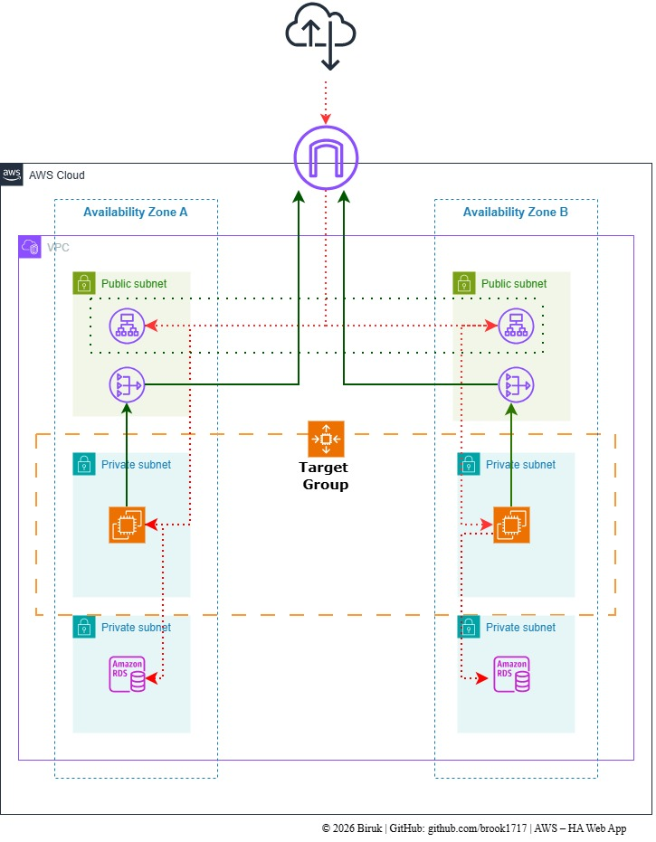
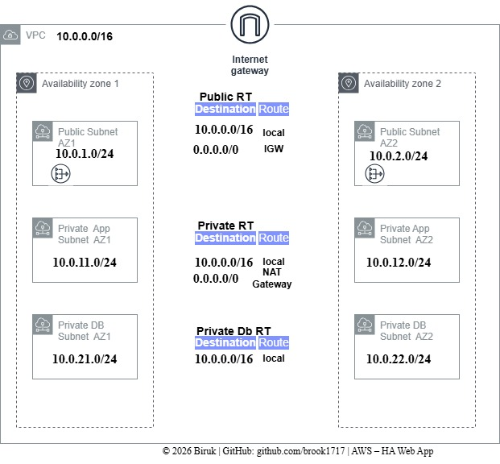
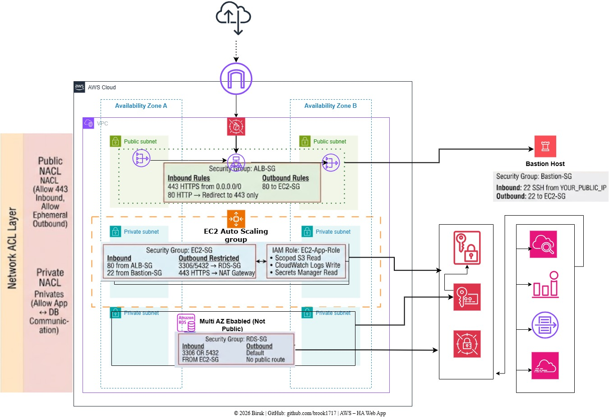

# Production-Ready High Availability Web Stack on AWS


## Table of Contents

- [Architecture Overview](#-architecture-overview)
- [Networking — The Foundation](#1️⃣-networking--the-foundation)
- [Compute & Elastic Scaling](#2️⃣-compute--elastic-scaling)
- [Security & Governance](#-security--governance)
- [Repository Structure](#-repository-structure)
- [FinOps — Cost Management Strategy](#-finops--cost-management-strategy)
- [Deployment Guide](#-deployment-guide)
- [CI/CD Integration](#-cicd-integration)
- [Skills Demonstrated](#-skills-demonstrated)
- [Future Improvements](#-future-improvements)
- [Connect With Me](#-connect-with-me)
- [License](#-license)

 A **production-grade, highly available 3-tier web architecture** built on **Amazon Web Services (AWS)** and provisioned entirely with **Terraform**.

This project demonstrates how to design, deploy, and manage **secure, scalable, and fault-tolerant infrastructure** following **AWS Well-Architected Framework principles**.

It serves as a **real-world blueprint for backend engineers and cloud architects** building resilient production systems.

---

# 🏗 Architecture Overview



The infrastructure is designed to achieve **high availability and fault tolerance** by distributing services across **multiple Availability Zones (AZs)**.

---

# 1️⃣ Networking — The Foundation



- Custom **VPC using a `/16` CIDR block** for long-term scalability
- **Tiered subnet architecture**

| Tier | Description |
|-----|-------------|
| Public | Hosts Application Load Balancer and NAT Gateways |
| Application | Private subnets containing EC2 instances |
| Database | Isolated private subnets hosting Amazon RDS |

### Key Characteristics

- Multi-AZ deployment
- No direct internet access to application instances
- Controlled outbound traffic via NAT Gateway
- Strict Security Group rules between tiers

---

# 2️⃣ Compute & Elastic Scaling

The application layer is built for **resilience and elasticity**.

Features include:

- **Auto Scaling Group (ASG)** for automatic horizontal scaling
- **Health checks** for self-healing infrastructure
- **Application Load Balancer (ALB)** distributing traffic across instances
- **CloudWatch metrics** triggering scaling policies

This allows the infrastructure to **handle traffic spikes while maintaining service availability**.

---

# Security & Governance



Security follows the **principle of least privilege** and **AWS best practices**.

## Identity & Access Management

- IAM roles for EC2 instances
- Fine-grained permissions for:
  - EC2 → S3 access
  - EC2 → RDS connectivity
- No hardcoded credentials

---

## Data Protection

### Encryption at Rest

- RDS storage encrypted using **AWS KMS**
- EBS volumes encrypted

### Encryption in Transit

- HTTPS enabled via **TLS 1.2+**
- Certificates managed through **AWS Certificate Manager**

---

## Network Hardening

Security Groups enforce **strict network segmentation**.

| Component | Allowed Ports |
|----------|---------------|
| ALB | 80 / 443 |
| Application | ALB only |
| Database | 5432 / 3306 from App Tier only |

This prevents **direct access to sensitive resources**.

---

## Repository Structure
```bash
markdown
highly-available-webapp/
│
├── .github/
│   └── workflows/        # CI/CD pipelines (terraform fmt & validate)
│
├── app/                  # Backend API
│
├── infrastructure/
│   └── terraform/
│       ├── modules/      # Reusable Terraform modules
│       │   ├── vpc/
│       │   ├── alb/
│       │   ├── ec2/
│       │   ├── rds/
│       │   └── iam/
│       │
│       ├── main.tf       # Root orchestration module
│       ├── variables.tf  # Typed input variables
│       ├── outputs.tf    # Infrastructure outputs
│       └── backend.tf    # Remote state (S3 + DynamoDB)
│
├── docs/                 # Architecture & security documentation
│
└── scripts/              # Load testing & failure simulations
```
The infrastructure is designed with **modular Terraform architecture**, enabling **reusability and maintainability**.

---

# FinOps — Cost Management Strategy

The architecture balances **production readiness with cost efficiency**.

| Service | Choice | Reason |
|-------|-------|-------|
| Compute | t3.micro | Suitable for proof-of-concept and Free Tier |
| Database | Multi-AZ RDS | Ensures failover capability |
| NAT Gateway | Managed NAT | Improves security and reliability |

For development environments:

- Multi-AZ can be disabled
- NAT Gateway can be replaced with NAT Instances
- Instance sizes can be reduced

---

# Deployment Guide

## Prerequisites

- AWS CLI configured
- Terraform installed
- Remote state infrastructure created

Required:

- **S3 bucket** for Terraform state
- **DynamoDB table** for state locking

---

## Initialize Terraform

```bash
terraform init \
-backend-config="bucket=my-tf-state" \
-backend-config="dynamodb_table=my-lock-table"
```
⚙ CI/CD Integration

GitHub Actions automatically validates infrastructure code.

Pipeline checks include:

terraform fmt

terraform validate

This ensures consistent formatting and valid infrastructure code before deployment.

🛠 Skills Demonstrated

This project highlights practical skills required for Backend + Cloud Engineering roles.

Infrastructure as Code

Terraform modular architecture

Remote state management

Infrastructure version control

Cloud Architecture

AWS VPC design

Multi-AZ high availability

Load balancing and autoscaling

DevOps

CI/CD with GitHub Actions

Infrastructure validation pipelines

Security Engineering

IAM least-privilege design

KMS encryption

Network segmentation

Future Improvements

Planned enhancements include:

Containerizing the backend using Docker

Deploying services on ECS or Kubernetes

Adding observability with Prometheus & Grafana

Implementing blue-green deployments

📬 Connect With Me

Backend Engineer focused on cloud infrastructure, distributed systems, and scalable backend architectures.

🔗 LinkedIn

📄 License

This project is open-source and available under the MIT License.